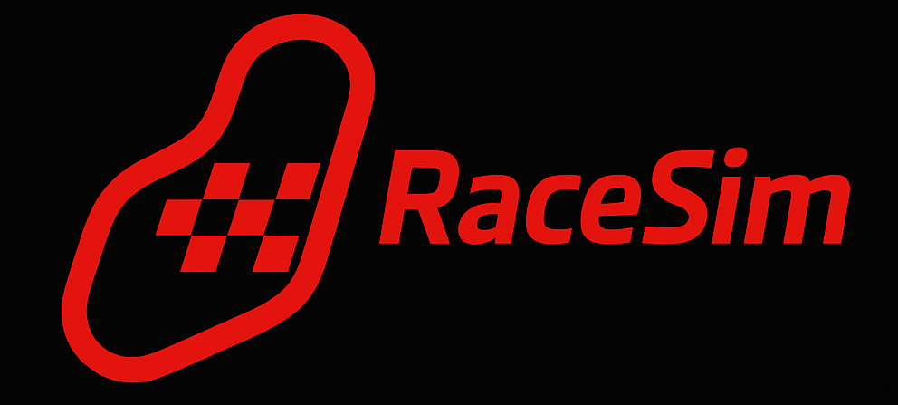

<h1 align="center">RaceSim v1</h1>

  RaceSim is a telemetry-driven racing visualization tool that joins endurance + telemetry datasets, processes them for consistency, and renders a full lap-by-lap replay of cars around the Barber Motorsports Park circuit.

📦 **Data Preparation Pipeline**

    Gather & Join Data
    Notebook: race_sim.ipynb

    JOIN endurance + telemetry data → produces common.parquet

    This enriches telemetry with endurance metadata

    *Note: Endurance data has no records for car IDs 0, 16, 78, so these cars are excluded from RaceSim*

⚙️ **Data Processing**

    Notebook: export_for_simulation.ipynb

    Step 1 - Fill & Clean

    Reads common.parquet
    → fills missing values
    → writes common2.parquet

    Step 2 - Export for Viewer

    Reads common2.parquet
    → optionally down-samples if telemetry is too granular
    → outputs race_canvas.json

    This JSON is consumed by the RaceSim front-end to simulate the race.

🎥 **Front-End Race Viewer**

    File: viewer2.html

    Visualizes the race by rendering race_canvas.json onto a high-performance canvas, simulating car motion, lap progression, and live metrics.

    🚀 How to Run the Application
    python -m http.server 8000

    Then open:
    http://localhost:8000/viewer2.html

    Car Selection
    Use Ctrl + Click to select multiple cars in the viewer.