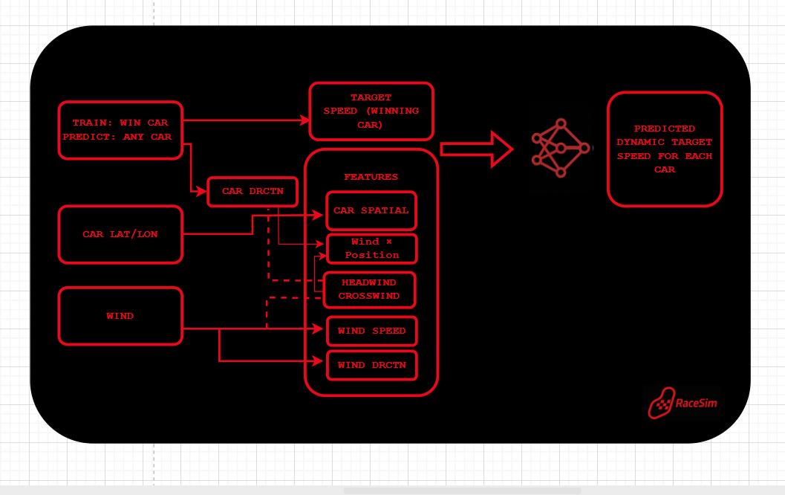
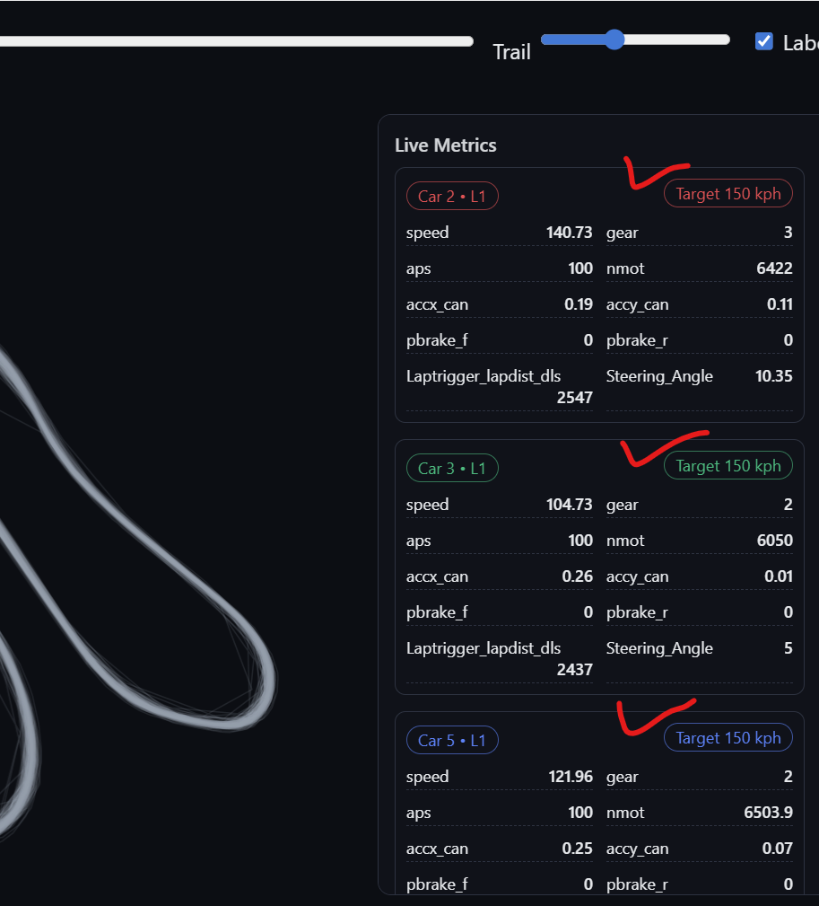

🏁 **RaceSim Roadmap**

RaceSim aims to evolve from a visualization tool into a full race-engineering intelligence system. The next phase focuses on predictive modelling using wind, track position, and car heading to estimate the dynamic target speed a car should be capable of at every point on the circuit.

The diagram below illustrates the planned ML pipeline - from data inputs, to feature engineering, to a trained model that learns from the winning car’s performance and generalizes that benchmark to all cars on track.

Upcoming Milestones
    
    1. Wind–Aware Predictive Model (Current Phase)
        Train on the winning car’s speed profile
        Incorporate wind vectors, car direction, spatial coordinates
        Add interaction features (wind × position)
        Predict target speed curve for any car
        Integrate with the viewer as a “target pace overlay”

    2. Pace Delta Visualization
        Compare actual vs target speed in real-time
        Highlight areas where a car is over- or under-performing
        Generate corner-by-corner improvement insights

    3. Sector-Based Performance Insights 
        Dynamic sector splits
        Wind-adjusted pace loss calculations
        Visual markers for braking & throttle optimization

    4. Ghost Car Simulation
        Overlay predicted vs actual ghost
        Side-by-side trajectory comparisons
        Adjustable playback speeds for coaching

  <b>For a sneak peek into the future alpha version, click here:</b> 
  <a href="https://ammihir.github.io/toyota-gazoo-data-hub/viewer3.html">
    https://ammihir.github.io/toyota-gazoo-data-hub/viewer3.html
  </a>
    
  <a href="https://ammihir.github.io/toyota-gazoo-data-hub/viewer3.html"><b>View Future Prototype</b></a>

